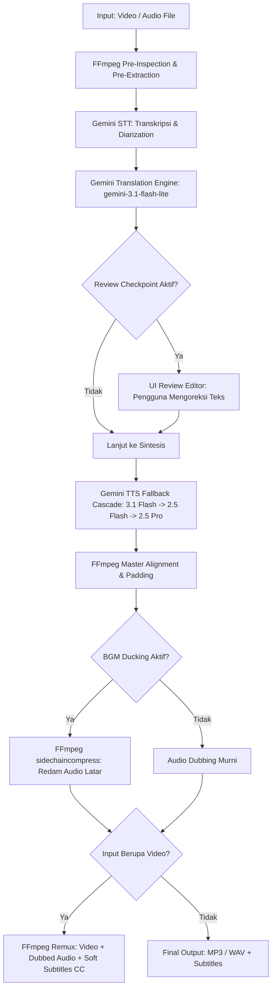

# AudioDub AI — Universal Linux Audio & Video Dubbing and TTS Studio

[](https://github.com/digitalninjanv/dubing/releases)
[](https://www.rust-lang.org)
[](https://gtk.org)
[](https://github.com/digitalninjanv/dubing)
[](https://github.com/digitalninjanv/dubing)
[](https://github.com/digitalninjanv/dubing)
[](LICENSE)

**AudioDub AI** adalah aplikasi desktop Linux modern (*GTK4 + Libadwaita + Rust*) berkinerja tinggi yang dirancang untuk penerjemahan berkas audio dan video, *voice dubbing* otomatis dengan sinkronisasi waktu presisi (*isochronous dubbing*), peredaman musik latar (*audio ducking*), penyematan subtitle otomatis (*soft subtitles*), serta produksi suara sintetis ekspresif melalui **TTS Studio**.

Aplikasi ini menggabungkan kecerdasan multimodal Google Gemini terbaru (`gemini-3.5-transcribe`, `gemini-3.1-flash-lite`, `gemini-3.1-flash-tts-preview`, `gemini-3.5-live-translate-preview`) dengan pemrosesan audio/video lokal deterministik via FFmpeg, menghasilkan hasil dubbing yang natural, tepat waktu, dan bebas distorsi.

---

## 📑 Daftar Isi

- [🚀 Instalasi Cepat 1 Baris (Universal Linux)](#-instalasi-cepat-1-baris-universal-linux)
- [✨ Fitur Unggulan (v0.3.12)](#-fitur-unggulan-v0312)
- [🏛️ Arsitektur Heksagonal & Alur Kerja](#️-arsitektur-heksagonal--alur-kerja)
- [🤖 Matriks Model Google Gemini](#-matriks-model-google-gemini)
- [💻 Panduan Penggunaan](#-panduan-penggunaan)
  - [1. Antarmuka Grafis Desktop (GUI)](#1-antarmuka-grafis-desktop-gui)
  - [2. Antarmuka Baris Perintah (CLI Companion)](#2-antarmuka-baris-perintah-cli-companion)
- [🛠️ Kompilasi dari Kode Sumber (Build from Source)](#️-kompilasi-dari-kode-sumber-build-from-source)
- [⚙️ Konfigurasi & Penyimpanan Sandi](#️-konfigurasi--penyimpanan-sandi)
- [🧪 Pengujian & Verifikasi Kualitas](#-pengujian--verifikasi-kualitas)
- [📄 Lisensi](#-lisensi)

---

## 🚀 Instalasi Cepat 1 Baris (Universal Linux)

AudioDub AI menyediakan skrip instalasi universal tanpa `sudo` (*rootless*) yang dapat dijalankan di seluruh distribusi Linux modern (**Ubuntu, Debian, Fedora, Arch Linux, Pop!_OS, Linux Mint, openSUSE, RHEL/AlmaLinux**, dll.).

Skrip ini otomatis memverifikasi rilis terbaru dari GitHub, mengunduh binary terkompilasi, memasang ke `~/.local/bin`, serta mendaftarkan file `.desktop` dan ikon SVG ke menu aplikasi sistem:

```bash
curl -fsSL https://raw.githubusercontent.com/digitalninjanv/dubing/main/install.sh | bash
```

> **Untuk menginstal versi spesifik:**
> ```bash
> curl -fsSL https://raw.githubusercontent.com/digitalninjanv/dubing/main/install.sh | bash -s -- --version v0.3.12
> ```

> **Untuk uninstall bersih kapan saja:**
> ```bash
> curl -fsSL https://raw.githubusercontent.com/digitalninjanv/dubing/main/install.sh | bash -s -- --uninstall
> ```

---

## ✨ Fitur Unggulan (v0.3.12)

### 🎙️ 1. Studio Multimodal Audio & Video Dubbing
- **Dukungan Format Luas:** Menerima input audio (`MP3, WAV, M4A, AAC, OGG, FLAC, WebM, Opus`) dan kontainer video (`MP4, MKV, MOV, WebM`) hingga ukuran **4 GB**.
- **⚡ Ultra-Fast Local Audio Pre-Extraction:** Untuk berkas video berukuran ratusan MB atau beberapa GB, AudioDub AI mengekstrak trek audio ringan (128 kbps 24 kHz mono MP3) secara lokal dalam **< 1 detik**, memangkas waktu unggah ke Google API dari ~5 menit menjadi seketika.
- **Dual Dubbing Engine:**
  - **Studio Multi-Stage:** Alur produksi lengkap dengan diarization transkripsi, terjemahan terstruktur, sintesis suara paralel, dan penyelarasan tempo.
  - **Live Fast Translate:** Menggunakan model `gemini-3.5-live-translate-preview` untuk proses kilat satu tahap.
- **Speaker Diarization & 5-Voice Assignment:** Mengenali pergantian pembicara dan menyediakan alokasi suara aktor terpisah untuk Pembicara 1 dan Pembicara 2 dari roster lengkap 5 suara resmi Gemini: **Kore, Puck, Aoede, Charon, Fenrir**.
- **Penyelarasan Waktu Presisi (*Isochronous Sync*):** Menyeimbangkan kuota karakter terjemahan, kompresi tempo cerdas via filter FFmpeg `atempo` (maksimal 1.25×), dan penyisipan jeda hening alami (*silence padding*).

### 🎵 2. Background Music (BGM) & Audio Ducking
- **Peredaman Dinamis Terintegrasi:** Menggunakan filtergraph audio profesional FFmpeg `sidechaincompress` + `amix` dengan proteksi `apad`.
- Saat suara dubbing berbicara, audio latar/musik asli secara otomatis diredam sebesar **~14 dB**.
- Pada jeda percakapan atau hening, musik latar kembali naik secara halus (*smooth release*), mempertahankan atmosfer dan musik latar video tanpa kesan hampa.

### 🎬 3. Soft Subtitles (Closed Captions) Tertanam di Kontainer Video
- **Subtitle Internal Kontainer:** Menyematkan berkas `.srt` langsung ke dalam stream video MP4/MOV (`-c:s mov_text`) dan MKV/WebM (`-c:s srt`).
- **Tagging ISO 639-2:** Dilengkapi metadata bahasa target resmi (misal: `ind`, `eng`, `jpn`, `spa`).
- Subtitle dapat diaktifkan atau dinonaktifkan secara bebas (*toggleable CC*) di pemutar media seperti VLC, Totem / GNOME Videos, QuickTime, serta ponsel Android & iOS.
- Otomatis menghasilkan berkas teks terpisah: **`.srt`**, **`.vtt`**, dan naskah bilingual paralel **`.txt`** di folder output.

### 📝 4. Interactive Review & Edit Transcript Checkpoint (Human-in-the-Loop)
- **Koreksi Teks Pra-Sintesis:** Opsi untuk menghentikan alur sementara (*asynchronous pause*) setelah tahap penerjemahan selesai.
- Pengguna dapat memeriksa naskah terjemahan per segmen waktu, mengoreksi nama orang, singkatan, atau istilah teknis langsung di antarmuka GTK4, lalu melanjutkan proses dubbing dengan teks hasil perbaikan.

### 🛡️ 5. Fallback Cascade & Retry Countdown Interaktif
- **Kaskade Fallback Multi-Model:** Jika kuota model utama `gemini-3.1-flash-tts-preview` penuh (HTTP 429) atau sedang maintenance, sistem secara otomatis beralih ke `gemini-2.5-flash-preview-tts` dan `gemini-2.5-pro-preview-tts` tanpa menggagalkan proses job.
- **Countdown Timer Detik-demi-Detik:** Menampilkan hitungan mundur waktu reset kuota secara langsung pada tampilan progress bar.

### ⚡ 6. Live API Key & Connection Validator
- Tombol **"Test Connection"** pada dialog Pengaturan (*Settings*) untuk memvalidasi API key secara instan via endpoint `GET /v1beta/models`.
- Panggilan zero-token (*0 token generative*) yang aman dan memberikan konfirmasi visual apakah API key aktif dan kuota tersedia.

### 🗣️ 7. TTS Studio (AI Studio Style)
- Memproduksi suara manusia sintetis langsung dari teks bebas tanpa berkas sumber.
- Mendukung *Custom Style Directive* (arahan emosi dan gaya bicara bebas, misal: *"Bicara dengan nada berbisik, misterius, dan dramatis"*).
- Kendali kecepatan berbicara (0.8× santai hingga 1.3× cepat) dengan pemutar audio dan ekspor MP3 instan.

---

## 🏛️ Arsitektur Heksagonal & Alur Kerja

AudioDub AI menerapkan prinsip *Clean Hexagonal Architecture* (Ports & Adapters) yang memisahkan logika bisnis murni dari dependensi eksternal (GTK, Tokio, Reqwest, FFmpeg):

```text
audiodub/
├── src/
│   ├── main.rs                     # Entry point & CLI/GUI dispatcher
│   ├── app.rs                      # AdwApplication lifecycle & styling
│   │
│   ├── domain/                     # Pure Business Logic (Bebas IO, GTK, Tokio, FFmpeg)
│   │   ├── audio.rs                # AudioDocument, AudioFormat, MediaMetadata
│   │   ├── language.rs             # LanguageId (ISO 639-2), LanguageRegistry
│   │   ├── transcript.rs           # Transcript, TranscriptSegment, WordTimestamp
│   │   ├── translation.rs          # TranslatedDocument, TranslationSegment
│   │   ├── synthesis.rs            # VoiceProfile, SpeakerVoiceConfig, AudioArtifact
│   │   ├── job.rs                  # Job, JobProgress, PipelineStage (12-state machine)
│   │   ├── subtitle.rs             # Generator format .srt, .vtt, dan bilingual .txt
│   │   └── errors.rs               # DomainError
│   │
│   ├── application/                # Use Cases & Interfaces (Ports)
│   │   ├── ports/                  # Trait contracts (AudioEngine, Transcriber, Synthesizer, dsb.)
│   │   └── pipeline.rs             # PipelineOrchestrator, ReviewRequest & Fallback Cascade
│   │
│   ├── infrastructure/             # Concrete Implementations (Adapters)
│   │   ├── gemini/                 # Client HTTP/2, Files API, Transcribe, Translate, TTS Fallback
│   │   ├── ffmpeg/                 # BGM Ducking, Soft Subtitles, Single-pass Aligner, ffprobe
│   │   ├── filesystem/             # Atomic JSON persistence, XDG Paths, Auto Cleanup
│   │   └── secrets/                # FreeDesktop Secret Service & Keyring
│   │
│   ├── config/                     # Settings & AppConfig
│   └── ui/                         # GTK4 + Libadwaita Presentation Layer
│       ├── views/                  # Dropzone, Progress, Review, Result, Settings, TTS Studio
│       └── components/             # Language Picker, Error Banners
└── tests/
    ├── unit/                       # Unit tests domain, language, dan subtitle
    └── integration/                # End-to-end workflow, audio engine ducking, dan benchmark
```

### 🔄 Diagram Alur Pemrosesan



---

## 🤖 Matriks Model Google Gemini

| Tahapan | Model Gemini | Endpoint REST | Peran & Karakteristik |
| :--- | :--- | :--- | :--- |
| **Speech-to-Text (< 20MB)** | `gemini-2.5-flash` | `POST /v1beta/models/...:generateContent` | **Inline Base64 Fast-Path**, bypass Files API, deteksi 85+ bahasa & timestamps. |
| **Speech-to-Text (≥ 20MB)** | `gemini-3.5-transcribe` | `POST /upload/v1beta/files` | Interactions & Files API untuk berkas rekaman panjang. |
| **Terjemahan Teks** | `gemini-3.1-flash-lite` | `POST /v1beta/models/...:generateContent` | Structured JSON mode, alokasi timing budget per segmen, gaya bahasa dinamis. |
| **Sintesis Suara (Primer)** | `gemini-3.1-flash-tts-preview` | `POST /v1beta/models/...:generateContent` | Native 24 kHz audio, multi-speaker profiling. |
| **Sintesis Suara (Fallback 1)** | `gemini-2.5-flash-preview-tts` | `POST /v1beta/models/...:generateContent` | Otomatis aktif jika kuota model primer habis / rate limited. |
| **Sintesis Suara (Fallback 2)** | `gemini-2.5-pro-preview-tts` | `POST /v1beta/models/...:generateContent` | Fallback tingkat tinggi untuk kualitas suara premium. |
| **Live Translation** | `gemini-3.5-live-translate-preview` | `POST /v1beta/models/...:generateContent` | Dubbing kilat langsung dari audio ke audio. |
| **Validasi Koneksi** | *Management Endpoint* | `GET /v1beta/models?key=...` | Zero-token validation untuk menguji keabsahan API Key. |

---

## 💻 Panduan Penggunaan

### 1. Antarmuka Grafis Desktop (GUI)

Luncurkan aplikasi melalui menu aplikasi desktop atau perintah terminal:

```bash
audiodub
```

1. **Konfigurasi API Key:**
   - Buka menu **Preferences / Settings** (ikon gir di HeaderBar).
   - Masukkan Google Gemini API Key Anda dari [Google AI Studio](https://aistudio.google.com/).
   - Klik **Test Connection** untuk memastikan koneksi aktif dan kuota tersedia, lalu tutup dialog.
2. **Pilih Berkas:**
   - Tarik & letakkan (*drag-and-drop*) berkas audio atau video ke area Dropzone, atau klik **Choose a File...**.
3. **Atur Preferensi Dubbing:**
   - **Bahasa Sumber & Target:** Pilih bahasa audio asli (`Auto Detect` didukung) dan bahasa target terjemahan.
   - **Translation Tone:** Pilih gaya bahasa (`Neutral`, `Casual`, `Formal`, `Creative`).
   - **Background Audio Ducking:** Aktifkan jika ingin mempertahankan musik latar / efek suara asli dengan peredaman otomatis.
   - **Review & Edit Translation:** Aktifkan jika ingin mengoreksi teks terjemahan sebelum suara disintesis.
   - **Speaker Voices:** Tentukan karakter suara berbeda untuk Speaker 1 dan Speaker 2.
4. **Mulai Proses:** Klik tombol **Translate & Dub Media**.
5. **Pemutaran & Ekspor:** Setelah selesai, putar audio atau tonton video hasil dubbing dengan soft subtitle langsung di pemutar terintegrasi, atau klik **Open Containing Folder**.

---

### 2. Antarmuka Baris Perintah (CLI Companion)

AudioDub AI dapat dijalankan secara penuh tanpa UI grafis untuk kebutuhan scripting, automasi server, dan batch processing:

```bash
# Menentukan API Key via environment variable
export GEMINI_API_KEY="AIzaSyYourGeminiApiKeyHere"

# 1. Dubbing berkas video MP4 dengan peredaman musik latar (ducking) dan soft subtitles
audiodub translate video.mp4 --source id --target en --tone casual --duck

# 2. Dubbing audio dengan penetapan suara multi-speaker spesifik
audiodub translate interview.mp3 --target ja --voice-1 Kore --voice-2 Puck --output interview_ja.mp3

# 3. Menggunakan engine Live Fast Translate
audiodub translate speech.wav --target es --live

# 4. Batch processing banyak berkas media sekaligus dalam satu antrean
audiodub batch video1.mp4 video2.mkv clip.wav --target en --tone neutral

# 5. Sintesis Text-to-Speech langsung melalui terminal
audiodub tts "Halo! Ini adalah contoh sintesis suara instan." --voice Puck --speed 1.0 --output halo.mp3

# 6. Text-to-Speech dengan arahan gaya bicara (AI Studio Style)
audiodub tts "Malam itu hening dan mencekam..." \
  --voice Charon \
  --style "Bicara seperti narator cerita horor dengan nada rendah, berat, dan jeda dramatis" \
  --output cerita.mp3
```

---

## 🛠️ Kompilasi dari Kode Sumber (Build from Source)

Jika ingin melakukan kompilasi mandiri dari kode sumber, pastikan *Rust toolchain* (1.75+) dan dependensi sistem telah terpasang:

### 1. Pasang Dependensi Sistem

<details open>
<summary><b>Debian / Ubuntu / Pop!_OS / Linux Mint</b></summary>

```bash
sudo apt update && sudo apt install -y \
  cargo rustc ffmpeg libgtk-4-dev libadwaita-1-dev pkg-config libssl-dev
```
</details>

<details>
<summary><b>Fedora / RHEL / AlmaLinux / Rocky Linux</b></summary>

```bash
sudo dnf install -y \
  gcc rust cargo gtk4-devel libadwaita-devel ffmpeg openssl-devel pkg-config
```
</details>

<details>
<summary><b>Arch Linux / Manjaro / EndeavourOS</b></summary>

```bash
sudo pacman -Syu --needed \
  rust cargo ffmpeg gtk4 libadwaita pkgconf openssl
```
</details>

<details>
<summary><b>openSUSE (Tumbleweed / Leap)</b></summary>

```bash
sudo zypper install -y \
  cargo rust gcc gtk4-devel libadwaita-devel ffmpeg libopenssl-devel pkg-config
```
</details>

---

### 2. Kompilasi & Menjalankan Binary

```bash
# Clone repository
git clone https://github.com/digitalninjanv/dubing.git
cd dubing

# Kompilasi binary rilis teroptimasi
cargo build --release

# Jalankan aplikasi
./target/release/audiodub
```

---

## ⚙️ Konfigurasi & Penyimpanan Sandi

- **Penyimpanan API Key:**
  - Prioritas utama: Sistem *FreeDesktop Secret Service* (GNOME Keyring / KWallet via `keyring-rs`).
  - Fallback aman: Berkas konfigurasi terlindungi dengan izin `0600` di `~/.config/audiodub/config.toml`.
  - Dukungan variabel lingkungan: `export GEMINI_API_KEY="..."`.
- **Direktori Keluaran (*Outputs*):**
  - Seluruh file hasil dubbing, video remuxed, dan subtitle tersimpan rapi di:  
    `~/.local/share/audiodub/outputs/`
- **Isolasi Berkas Temporer (*Sandboxing*):**
  - Setiap job diproses dalam direktori terisolasi `~/.local/share/audiodub/jobs/<job_id>/`.
  - Berkas segmen audio sementara otomatis dibersihkan setelah proses selesai (dapat diubah via opsi *Debug Mode* di Settings).

---

## 🧪 Pengujian & Verifikasi Kualitas

Basis kode AudioDub AI diuji dengan standar kualitas ketat bebas celah keamanan:

```bash
# Pengecekan formatting kode standar
cargo fmt --check

# Pemeriksaan linter Clippy (Zero Warning Policy)
cargo clippy --all-targets --all-features -- -D warnings

# Menjalankan seluruh pengujian unit, integrasi, dan benchmark
cargo test --all-targets
```

---

## 📄 Lisensi

Proyek ini dirilis di bawah lisensi terbuka [MIT License](LICENSE).  
Bebas digunakan, dimodifikasi, dan didistribusikan untuk keperluan personal maupun komersial.
